# Swimming Pool Mangement System

This is a management system for a swimming pool that is used for professional swimmers in competitions and also for training beginner and advance swimmers.

# About the Author

Name: Samira Mc Queen
[LinkedIn](https://www.linkedin.com/in/samira-mc-queen-1882431a7/)

Free Spririted Caribbean Woman.
Software Developer and aspiring Game Developer

# Swimming Pool Managment System Project

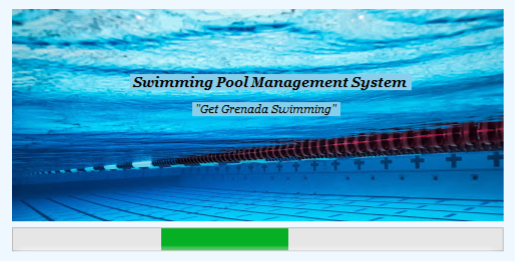

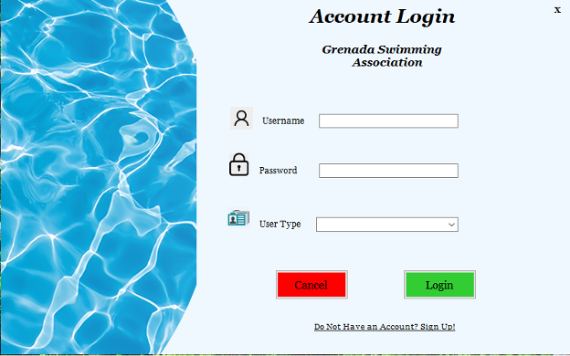

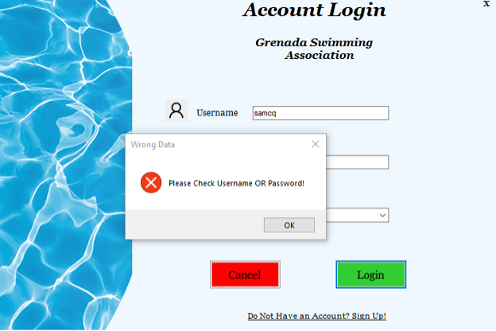

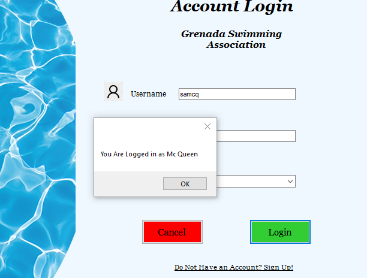

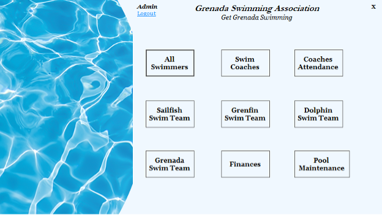

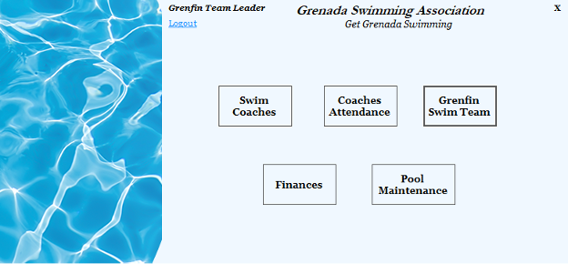

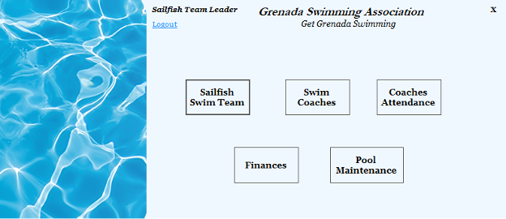

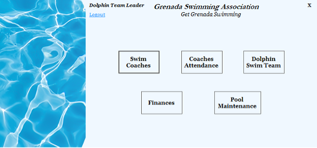

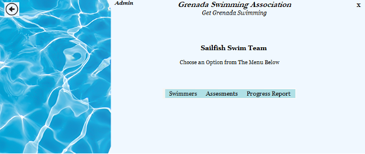

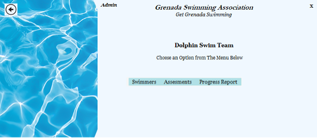

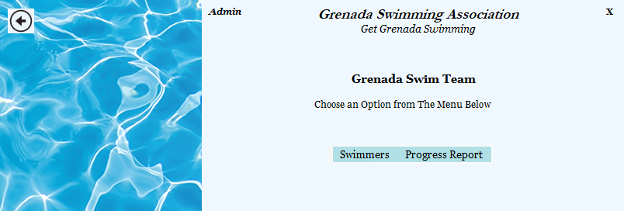

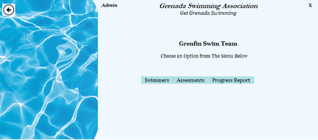

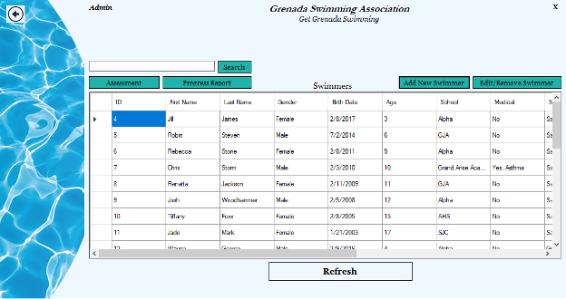

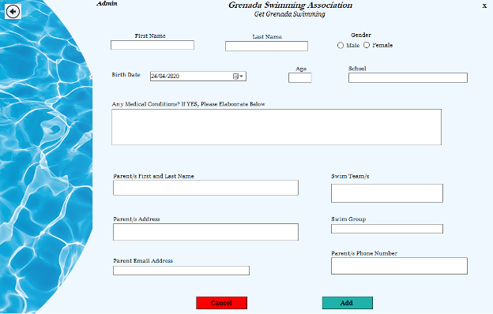

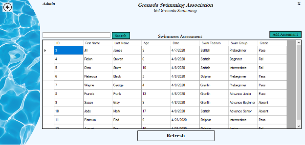

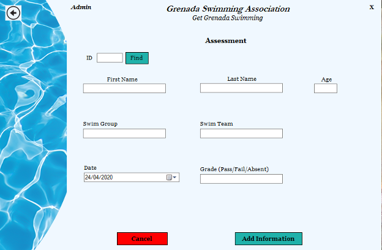

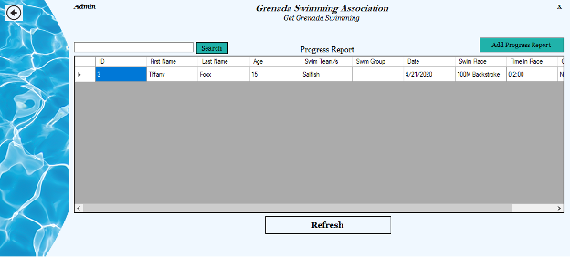

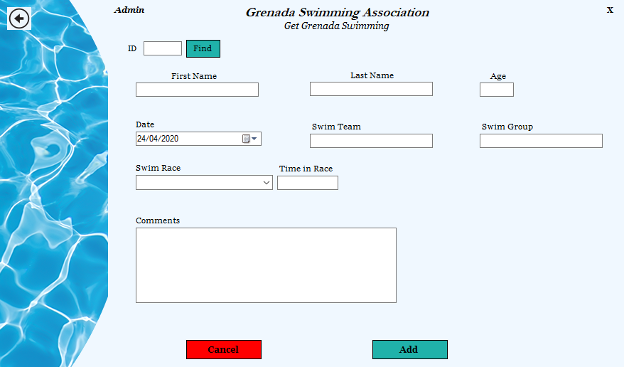

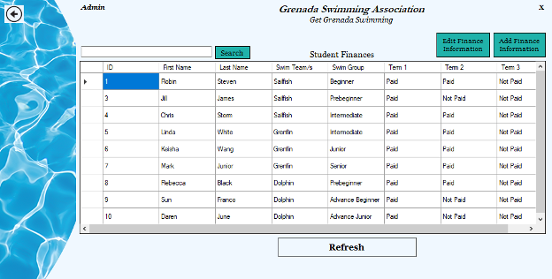

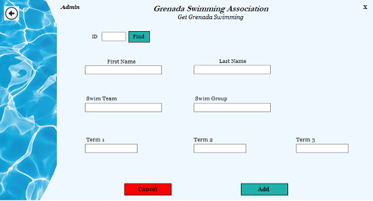

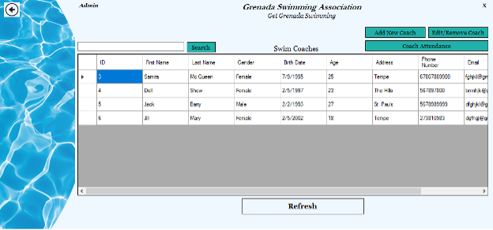

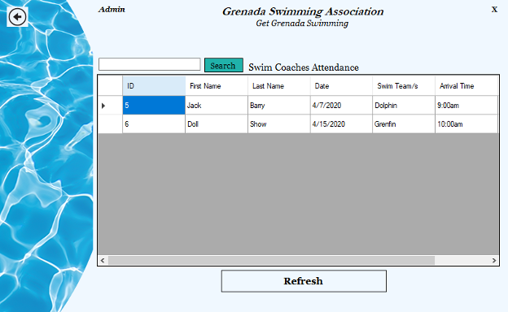

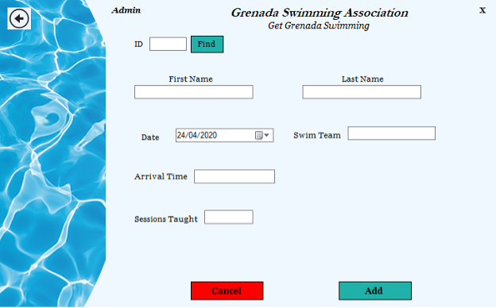

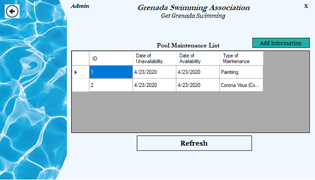

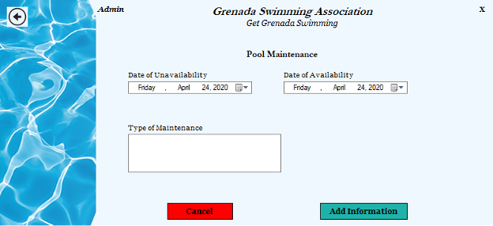

## Experience with Project

- This was my final project submission for Grdautaion from University.
- It was my first time usig C# but i had knowledge uisng the forms from Visual Basic
- It was fun creating something from beginning to end

# Application Features

- User can login/logout
- Admin user can view everyting on the dashboard
- Swim teams can add new swimmer, edit swimmmer's information, delete swimmer
- User is able to manage finances and pool maintenance
- List of swimmers from each team can be viewed
- Each swimmer's assessments are stored for each term
- Each swimmer's report can be added and viewed for each term

# Frontend Built With

- C#
- .NET

# Backend Built With

- MySQL Qorkbench
- MyPHPAdmin

# Project setup

The porject is no longer available due to the backend but the frontend can still be used

- Download code as Zip file
- Clone using Github Desktop or Clone using terminal in code editor
